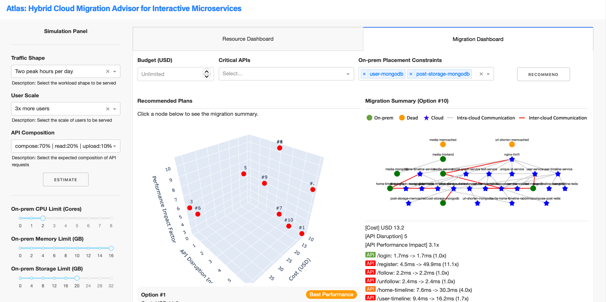

# Atlas: Hybrid Cloud Migration Advisor for Interactive Microservices

Hybrid cloud provides an attractive solution to microservices for better resource elasticity. A subset of application components can be offloaded from the on-premises cluster to the cloud, where they can readily access additional resources. However, the selection of this subset is challenging because of the large number of possible combinations. A poor choice degrades the application performance, disrupts the critical services, and increases the cost to the extent of making the use of hybrid cloud unviable. This paper presents Atlas, a hybrid cloud migration advisor. Atlas uses a data-driven approach to learn how each user-facing API utilizes different components and their network footprints to drive the migration decision. It learns to accelerate the discovery of high-quality migration plans from millions and offers recommendations with customizable trade-offs among three quality indicators: end-to-end latency of user-facing APIs representing application performance, service availability, and cloud hosting costs. This repository contains the source code and documentation of this project, which are organized in the following directories. You can refer to the `README.md` file in each directory for instruction and details.
* `./social-network`: The source code of the social network application for deployment on the cloud
* `./locust`: The source code of the load generator
* `./migration-advisor`: The source code of the migration advisor

> Ka-Ho Chow, Umesh Deshpande, Veera Deenadhayalan, Sangeetha Seshadri, and Ling Liu, "Atlas: Hybrid Cloud Migration Advisor for Interactive Microservices," ACM European Conference on Computer Systems (EuroSys), Athens, Greece, Apr. 22-25, 2024.

