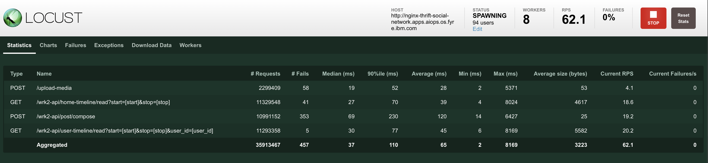

# Workload Generator
This directory contains the workload generator on the social network application. It is implemented with [LOCUST](https://locust.io) and you can configure the script to generate different API traffic for experiment purposes. For more details, you can refer to our paper at EuroSys'24:
> Ka-Ho Chow, Umesh Deshpande, Veera Deenadhayalan, Sangeetha Seshadri, and Ling Liu, "Atlas: Hybrid Cloud Migration Advisor for Interactive Microservices," ACM European Conference on Computer Systems (EuroSys), Athens, Greece, Apr. 22-25, 2024.


# Instruction
This section describes how to run the load generator using locust with a distributed configuration.

1. Copy this `locust` folder to the machine where you want to run the client load generator
2. Create a virtualenv with the provided `requirements.txt`. This makes sure the libraries used in this repository do not interfere with your own programming environment
```bash
python3 -m venv venv
source venv/bin/activate
pip install -r requirements
```
3. Run the warmup script to initialize the social network with a real social graph from Facebook. Replace the `XXX` below with the location the nginx-thrift obtained from the `Routes` page in Openshift Console. 
```bash
python warmup.py --addr=XXX
```
4. Edit the `locustfile.py` and replace `GLOBAL_NGINX_FRONTEND_URL` and `GLOBAL_MEDIA_FRONTEND_URL` by the URLs of nginx-thrift and media-frontend.

5. Run locust in a distributed setting to allow more simulated users. The example below creates one master process and eight worker processes. They can be run on the same machine, which will leverage different cores for simulating users.
```bash
locust --web-port=8090 --csv=log --csv-full-history --master
locust --web-port=8090 --csv=log --csv-full-history --worker
locust --web-port=8090 --csv=log --csv-full-history --worker
locust --web-port=8090 --csv=log --csv-full-history --worker
locust --web-port=8090 --csv=log --csv-full-history --worker
locust --web-port=8090 --csv=log --csv-full-history --worker
locust --web-port=8090 --csv=log --csv-full-history --worker
locust --web-port=8090 --csv=log --csv-full-history --worker
locust --web-port=8090 --csv=log --csv-full-history --worker
```
5. Visit the webpage with port 8090. You should see the UI similar to the following with a start button on the top right. Click it and the simulation will begin.


# Configuration
By default, the load generator generates periodic traffic where two peaks are simulated for each cycle. You can edit the `locustfile.py` to change the simulation configuration and also the `tick()` function to generate any API traffic shape you would like to explore.
```python
LOW_DAYS = 3
HIGH_DAYS = 7
GLOBAL_EXPERIMENT_DURATION = 60 * 10 * (LOW_DAYS + HIGH_DAYS)
GLOBAL_SECONDS_PER_DAY     = 60 * 10
GLOBAL_MIN_USERS_I         = 100
GLOBAL_MIN_USERS_II        = 300
GLOBAL_PEAKS_I             = [260, 280, 300]
GLOBAL_PEAKS_II            = [780, 840, 900]
GLOBAL_RANDOMNESS          = 0.10
GLOBAL_WAIT_TIME           = between(1, 3)
```