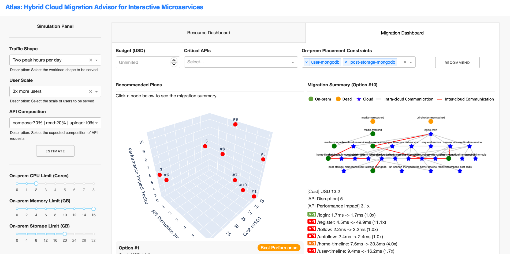

# Web-based Demonstration


This directory contains the scripts to postprocess telemetry data and traces collected from running the social network application for hybrid cloud migration. It also includes a web-based demonstration using NSGA-2 with Atlas's quality modeling techniques. The demonstration is preloaded with different types of API traffic, and the user can adjust the on-prem resource limit to simulate the environment where the on-prem resources are insufficient to serve the traffic. For more details, you can refer to our paper at EuroSys'24:
> Ka-Ho Chow, Umesh Deshpande, Veera Deenadhayalan, Sangeetha Seshadri, and Ling Liu, "Atlas: Hybrid Cloud Migration Advisor for Interactive Microservices," ACM European Conference on Computer Systems (EuroSys), Athens, Greece, Apr. 22-25, 2024.


# Installation
Follow the instruction below to create a virtual environment and install necessary Python libraries.

* Create and activate a virtual environment  
```bash
virtualenv venv
source venv/bin/activate
```

* Manually install the following Python libraries or run `pip install -r requirements.txt`
```bash
gunicorn>=19.9.0
numpy>=1.16.2
pandas>=0.24.2
datetime==4.3
pathlib==1.0.1
dash
pymoo
dash_cytoscape
packaging
```

# Postprocess Data
1. Export traces from Elasticsearch and get the `EXPERIMENT_ID`
```bash
python ./postprocess/01_exporter-jaeger.py [ELASTICSEARCH_HOST] [ELASTICSEARCH_INDEX]
```
2. Export resource utilization data
```bash
python ./postprocess/02_exporter-istio.py [PROMETHEUS_URL] [EXPERIMENT_ID]
```
3. Transform traces into traffic
```bash
python ./postprocess/03_trace-to-traffic.py [EXPERIMENT_ID]
```
4. Learn network footprint
```bash
python ./postprocess/04_network-footprint-learning.py [EXPERIMENT_ID]
```
5. Extract representative traces for end-to-end latency modeling
```bash
python ./postprocess/05_representative-traces.py [EXPERIMENT_ID]
```

# Run the Web-based Demo
After following the instruction to install necessary libraries, you can run the web-based demo with:
```bash
python app.py
```